# Monaco Color Scheme
### Don't you &hearts; that colorful **Code**?
The colorschemes are based on [Agilia Monokai Extended colorscheme](https://github.com/arvi/Agila-Theme). That colorscheme was highly modified to look like what they are now.

## Install
Just clone (or download the repo and extract) in 'Packages' directory of your sublime configuration. 

#### For Linux
```shell
    cd ~/.config/sublime-text-3/Packages
    git clone https://github.com/lightify97/monaco-colorscheme
```
And then Select from the *Preferences > colorscheme > monaco in sublime text.

## Screenshots
### C
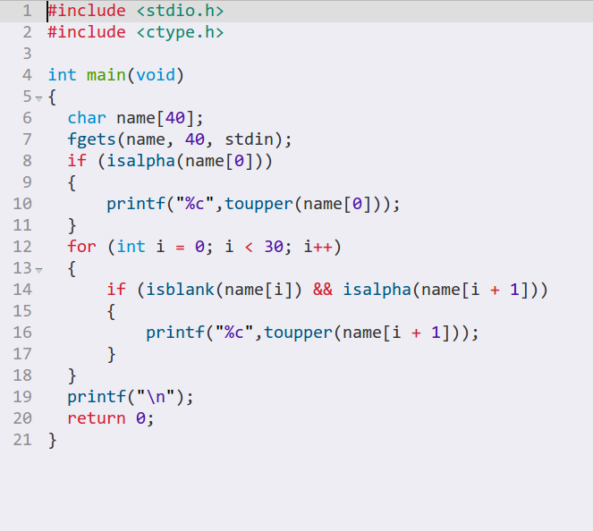
<br >
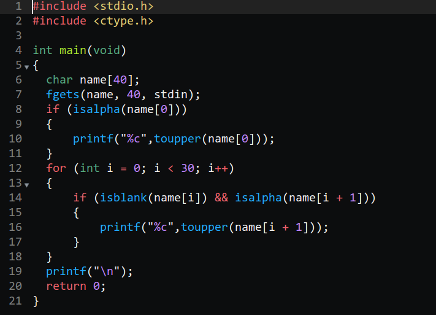
### CSS
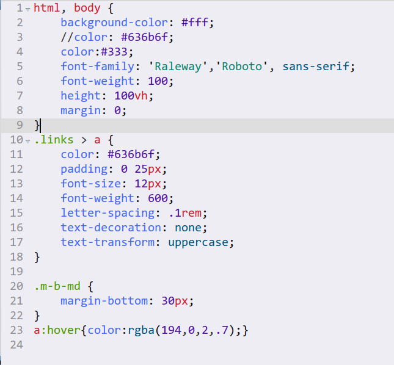
<br >
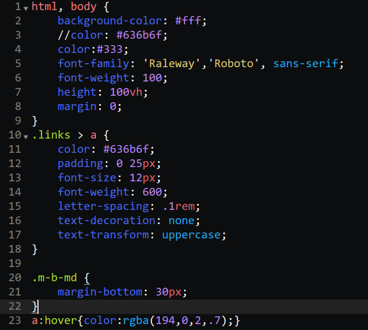
### HTML
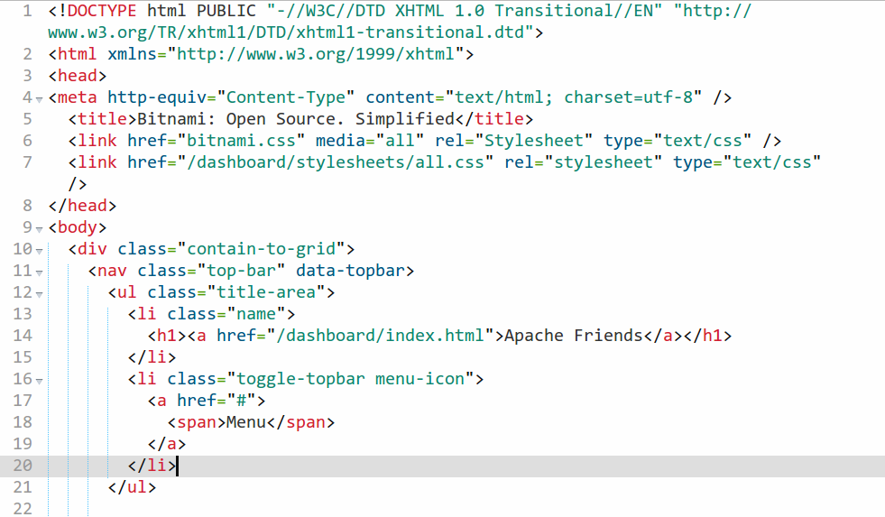
<br >
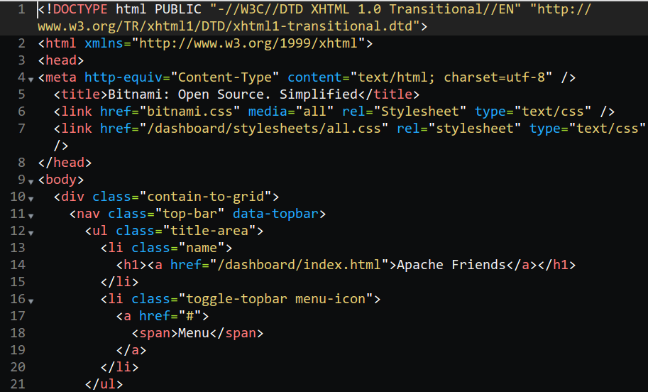
### JS
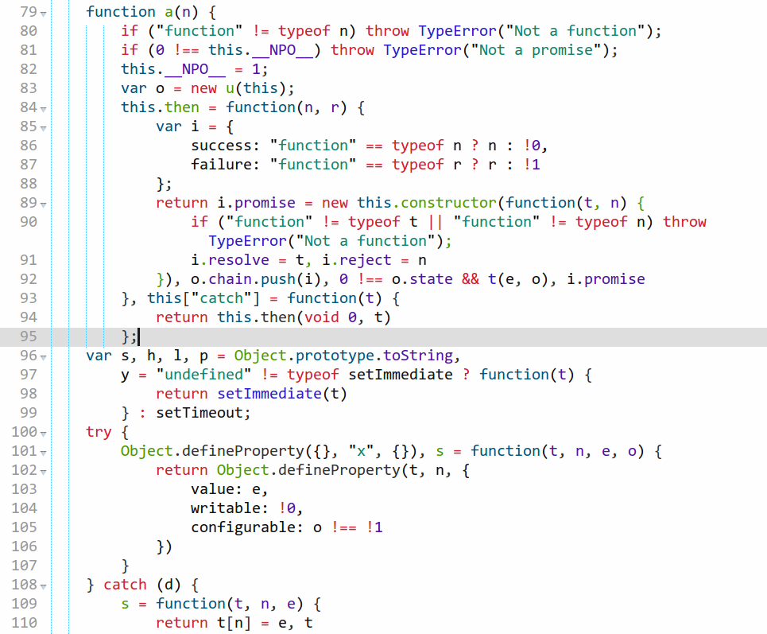
<br >
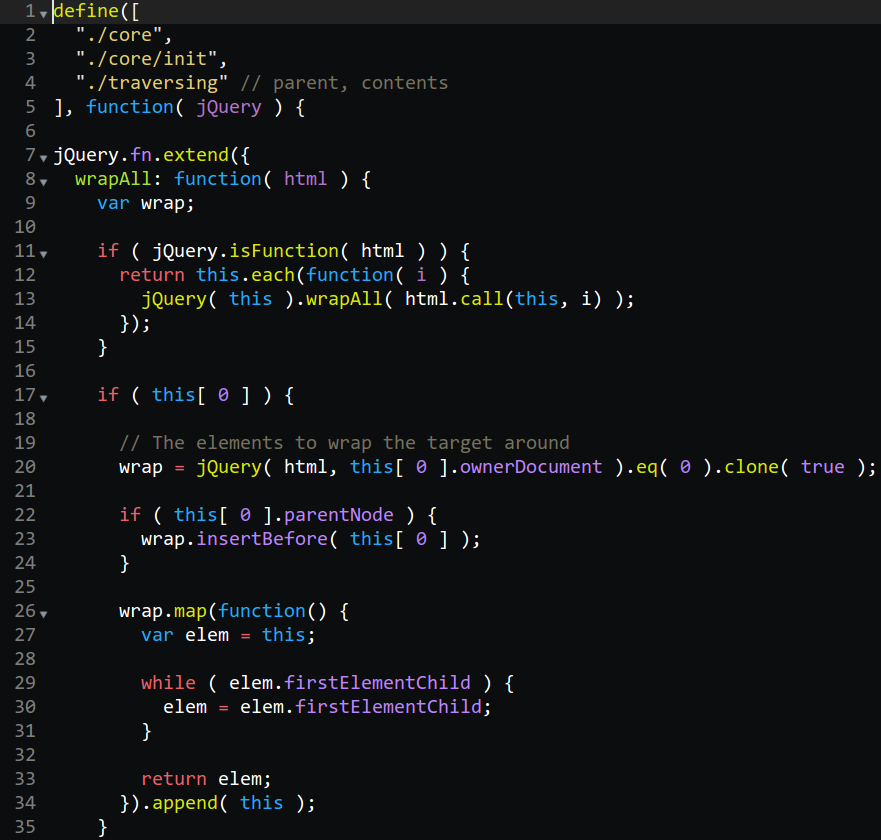
### PHP
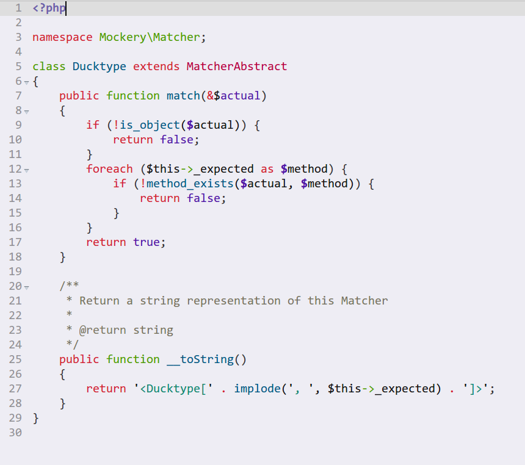
<br >
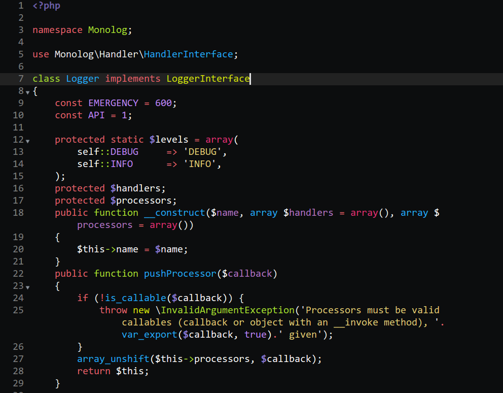
### PYTHON
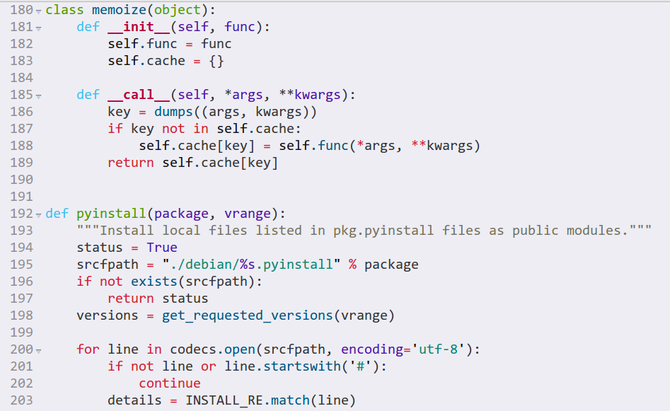
<br >
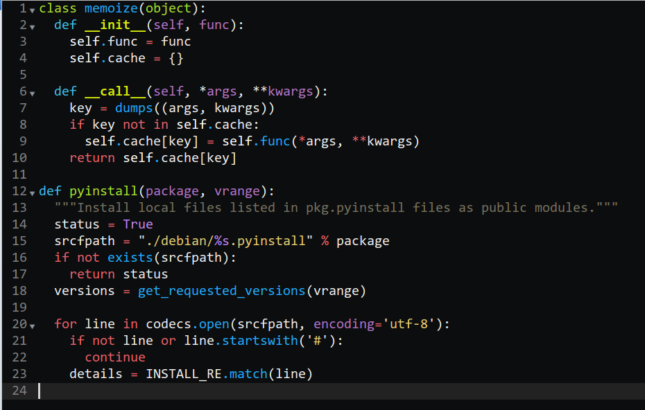
