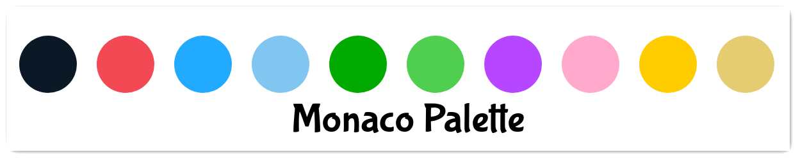
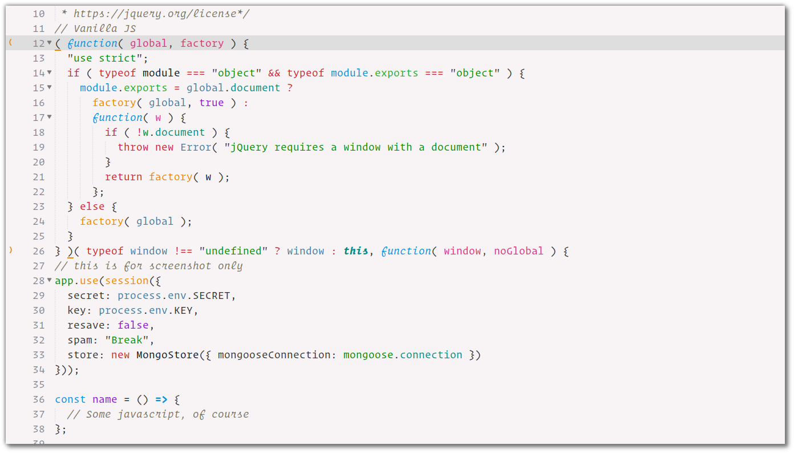

# Monaco Color Scheme
### Don't you &hearts; that colorful **Code**?

**Now with extensive coverage of Python and Javascript code.**
## Palette

## Install
* <h3>Package Control</h3>
    Search for 'Monaco' and it should show up in the results.

* <h3>Manual</h3>
    Just clone (or download the repo and extract) in 'Packages' directory of your sublime configuration.

    #### For Ubuntu Linux
    ```shell
    $ cd ~/.config/sublime-text-3/Packages
    $ git clone https://github.com/lightify97/monaco-colorscheme
    ```
And then Select from **Preferences > colorscheme > monaco** in sublime text.

## Screenshots





